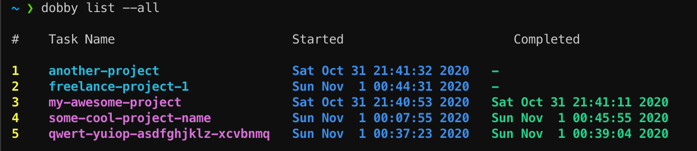

<div align="center">
  
</div>

# Dobby

[](https://github.com/alioguzhan/dobby/actions)

Dobby is a command-line tool to track your activities / time. It helps you to track how much time you spent on your activities or projects.

- You can ask Dobby `start` a task when you want to start working on something.
- You are done? Tell Dobby to `stop` that activity.
- You also can ask to Dobby to list your tasks.

Here is the screenshot of the list view:



## Usage

Here is the list of available commands for Dobby:

To start a task:

```bash
$ dobby start project-name
```

To stop a specific task:

```bash
$ dobby stop project-name
```

To list you active tasks:

```bash
$ dobby list
```

If you want to see all your tasks including completed ones:

```bash
$ dobby list --all
```

## Installation

Download the latest release from [releases page](https://github.com/alioguzhan/dobby/releases) and run:

```bash
./configure
make
make install
```

Now you should be able to run `dobby` from anywhere in your terminal.


## Road Map / To Do

- [ ] Add `report` feature to generate an HTML file that derives some stats from all tasks.
- [ ] Check the correctnes off `db` file on each start (In case of user or other programs modified it).
- [x] Make sure it is working properly on both `linux` and `macos` (github actions).
- [ ] There are some duplicates among the code. Refactor the code base.
- [ ] Run `valgrind` on each push and PR.
- [ ] `VS Code` extension to track programming projects automatically ?? (long shot..)


## Contribution

Any kind of contribution will be appreciated. Please open an issue or PR.


## Support S.P.E.W

`Society for the Promotion of Elfish Welfare (S.P.E.W)` is an organizational effort to gain basic rights for house elves.


## Logo

That Dobby image is taken from [Pinterest](https://pinterest.com/pin/356558495496348737/).

