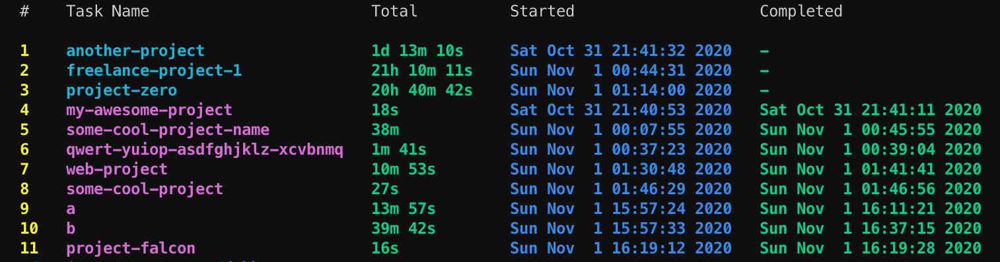

<div align="center">
  
</div>

# Dobby

Dobby is a command-line tool to track your activities / time. It helps you to track how much time you spent on your activities or projects.

- You can ask Dobby `start` a task when you want to start working on something.
- You are done? Tell Dobby to `stop` that activity.
- You also can ask to Dobby to list your tasks.

Here is the screenshot of the list view:



## Usage

Here is the list of available commands for Dobby:

To start a task:

```bash
$ dobby start project-name
```

To stop a specific task:

```bash
$ dobby stop project-name
```

To list you active tasks:

```bash
$ dobby list
```

If you want to see all your tasks including completed ones:

```bash
$ dobby list --all
```

## Installation

- Clone the repository.
- Run `make` and then `make install` to install Dobby.

Now you should be able to run `dobby` from anywhere in your terminal.

## Contribution

Any kind of contribution will be appreciated. Please open an issue or PR.

## Logo

That Dobby image is taken from [Pixel Art Maker](http://pixelartmaker.com).

